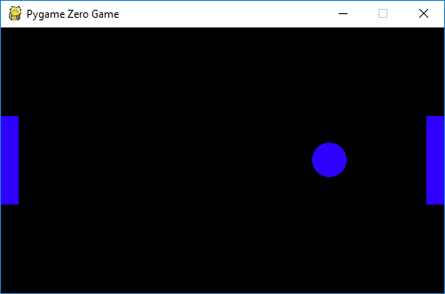

# Pygame Zero - Pong
Martin O'Hanlon (martin@ohanlonweb.com)
[www.stuffaboutcode.com](http://www.stuffaboutcode.com)

## Description
A unfinished pygame zero interpretation of Pong

For more information see [www.stuffaboutcode.com/2015/09/pygame-zero-pong.html](http://www.stuffaboutcode.com/2015/09/pygame-zero-pong.html)

## Install

git clone https://github.com/martinohanlon/pgzero-pong

This assumes you already have pygame zero installed. [pygame-zero.readthedocs.org/en/latest/installation.html](http://pygame-zero.readthedocs.org/en/latest/installation.html)

## Run

pgzrun pong.py

## Controls

Player 1 - Q & A
Player 2 - K & M

## Version history
* 0.1 - Initial stable version
