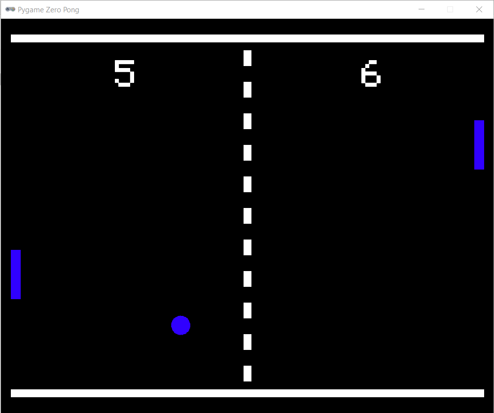
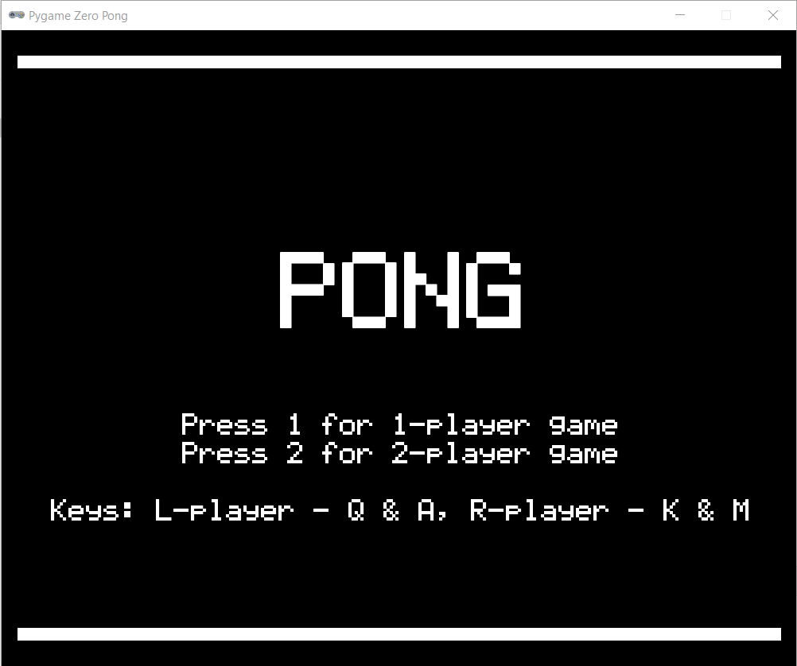
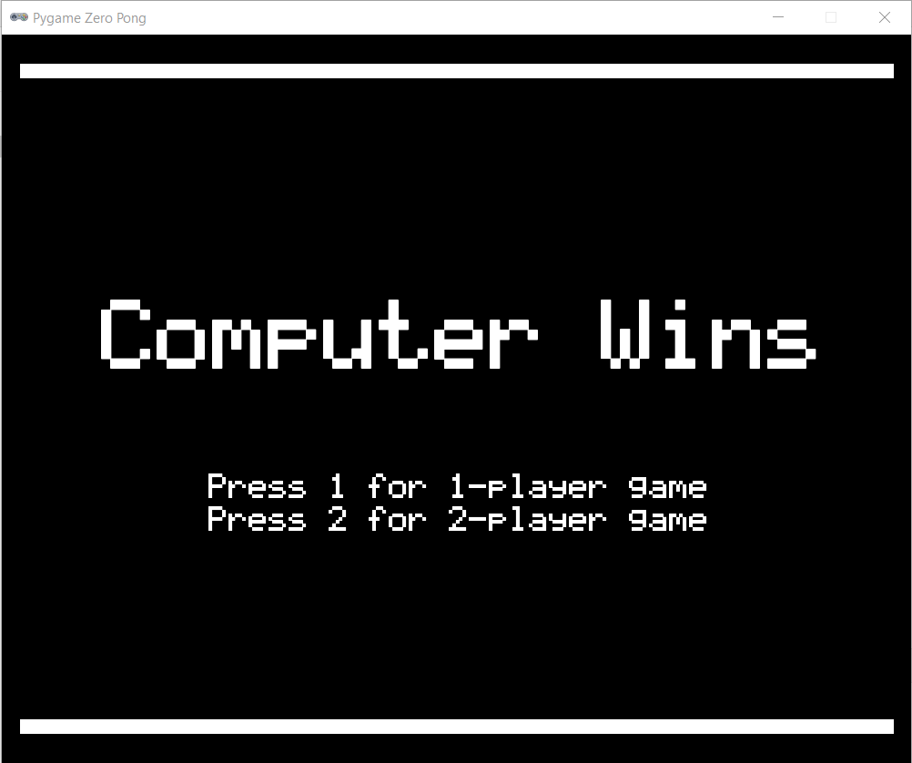

# Pygame Zero - Pong

A fork of a basic Pong game in Python/pygame zero written by Martin O'Hanlon (martin@ohanlonweb.com)
[www.stuffaboutcode.com](http://www.stuffaboutcode.com) for the version this program is based on.

## Description

After looking at Martin O'Hanlon's unfinished Pong interpretation I decided to try to complete it so it can actually be played.
This fork now includes the following features:
* 1-player mode with computer-controlled opponent
* Start screen with 1 or 2-player mode selection

* On-screen score display
* Game win at 11 point

## Controls

Player 1 - Q & A
Player 2 - K & M

## Version history
* 0.1 - Initial stable version
